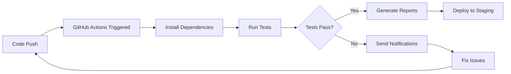

# 🎓 Playwright Framework Training Workshop

## 📋 Workshop Agenda

### Session 1: Framework Introduction (2 hours)
- **Overview of Test Automation** (30 min)
- **Playwright vs Other Tools** (20 min)
- **Framework Architecture Tour** (40 min)
- **Hands-on Setup** (30 min)

### Session 2: Writing Your First Tests (2 hours)
- **Page Object Model Deep Dive** (45 min)
- **Test Writing Best Practices** (45 min)
- **Hands-on Test Creation** (30 min)

### Session 3: Advanced Features (2 hours)
- **Data-Driven Testing** (40 min)
- **Test Prioritization & Tags** (30 min)
- **Error Handling & Debugging** (50 min)

### Session 4: CI/CD & Production (1.5 hours)
- **GitHub Actions Pipeline** (45 min)
- **Reporting & Monitoring** (30 min)
- **Q&A and Next Steps** (15 min)

---

## 🎯 Session 1: Framework Introduction

### What is Test Automation?

**Traditional Manual Testing:**
- Time-consuming and repetitive
- Prone to human error
- Difficult to scale
- Limited coverage

**Automated Testing Benefits:**
- ✅ **Speed**: Run hundreds of tests in minutes
- ✅ **Reliability**: Consistent execution every time
- ✅ **Coverage**: Test more scenarios than manual testing
- ✅ **Cost-Effective**: Reduce long-term testing costs
- ✅ **CI/CD Integration**: Automated quality gates

### Why Playwright?

#### Playwright vs Selenium
| Feature | Playwright | Selenium |
|---------|------------|----------|
| **Speed** | ⚡ Very Fast | 🐢 Slower |
| **Setup** | 📦 Simple | 🔧 Complex |
| **Browsers** | 🌐 Chrome, Firefox, Safari | 🌐 Chrome, Firefox, Safari |
| **Auto-Wait** | ✅ Built-in | ❌ Manual waits needed |
| **Mobile** | ✅ Device emulation | ❌ Limited |
| **Debugging** | 🔍 Excellent tools | 🔍 Basic |
| **Parallel** | ✅ Built-in | 🔧 Requires setup |

#### Playwright vs Cypress
| Feature | Playwright | Cypress |
|---------|------------|---------|
| **Multi-Browser** | ✅ Chrome, Firefox, Safari | ❌ Chrome only |
| **Multi-Tab** | ✅ Full support | ❌ Limited |
| **API Testing** | ✅ Built-in | 🔧 Additional tools |
| **File Upload** | ✅ Easy | 🔧 Workarounds |
| **Mobile Testing** | ✅ Device emulation | ❌ No mobile |

### Framework Architecture Overview

```
🏗️ BTL Playwright Framework Architecture

┌─────────────────────────────────────────────────────────┐
│                     Test Layer                          │
│  ┌─────────────┐ ┌─────────────┐ ┌─────────────┐      │
│  │ Login Tests │ │ User Tests  │ │ API Tests   │      │
│  └─────────────┘ └─────────────┘ └─────────────┘      │
└─────────────────────────────────────────────────────────┘
                            ↓
┌─────────────────────────────────────────────────────────┐
│                    Page Object Layer                    │
│  ┌─────────────┐ ┌─────────────┐ ┌─────────────┐      │
│  │ Base Page   │ │ Login Page  │ │ User Page   │      │
│  └─────────────┘ └─────────────┘ └─────────────┘      │
└─────────────────────────────────────────────────────────┘
                            ↓
┌─────────────────────────────────────────────────────────┐
│                    Utility Layer                        │
│  ┌─────────────┐ ┌─────────────┐ ┌─────────────┐      │
│  │Data Manager │ │Logger Utils │ │API Utils    │      │
│  └─────────────┘ └─────────────┘ └─────────────┘      │
└─────────────────────────────────────────────────────────┘
                            ↓
┌─────────────────────────────────────────────────────────┐
│                     Data Layer                          │
│  ┌─────────────┐ ┌─────────────┐ ┌─────────────┐      │
│  │Login Data   │ │User Data    │ │Config Data  │      │
│  └─────────────┘ └─────────────┘ └─────────────┘      │
└─────────────────────────────────────────────────────────┘
```

### Hands-on Setup Exercise

#### Exercise 1: Environment Setup (15 minutes)

**Step 1: Clone and Install**
```bash
# Clone the repository
git clone https://github.com/jibinjoyqa/btl-playwright-automation.git
cd btl-playwright-automation

# Install dependencies
npm install
npx playwright install
```

**Step 2: Configure Environment**
```bash
# Copy environment template
cp .env.template .env

# Edit .env file with your credentials
# Use your assigned test credentials
```

**Step 3: Verify Setup**
```bash
# Run environment validation
node scripts/validate-env.js

# Run a simple test
npx playwright test login.spec.ts --headed
```

#### Exercise 2: Explore the Framework (15 minutes)

**Task**: Navigate through the codebase and identify:
1. Where are the page objects located?
2. What test data files exist?
3. Which utility functions are available?
4. How are tests organized?

**Discussion Points**:
- Framework structure benefits
- Separation of concerns
- Reusability patterns

---

## 🎯 Session 2: Writing Your First Tests

### Page Object Model Deep Dive

#### What is Page Object Model?

**Without POM (Bad Practice):**
```typescript
test('Login test', async ({ page }) => {
  await page.goto('/login');
  await page.fill('#username', 'user@example.com');
  await page.fill('#password', 'password123');
  await page.click('#login-btn');
  await expect(page.locator('.dashboard')).toBeVisible();
});

test('Another login test', async ({ page }) => {
  await page.goto('/login');
  await page.fill('#username', 'admin@example.com');  // Duplicate code!
  await page.fill('#password', 'admin123');           // Hard to maintain!
  await page.click('#login-btn');                     // Locator changes break multiple tests!
  // ... more duplicate code
});
```

**With POM (Best Practice):**
```typescript
// Page Object
export class LoginPage {
  constructor(private page: Page) {}
  
  // Locators
  private usernameInput = this.page.locator('#username');
  private passwordInput = this.page.locator('#password');
  private loginButton = this.page.locator('#login-btn');
  private dashboard = this.page.locator('.dashboard');
  
  // Actions
  async login(username: string, password: string) {
    await this.usernameInput.fill(username);
    await this.passwordInput.fill(password);
    await this.loginButton.click();
  }
  
  // Verifications
  async isLoginSuccessful(): Promise<boolean> {
    return await this.dashboard.isVisible();
  }
}

// Test
test('Login test', async ({ page }) => {
  const loginPage = new LoginPage(page);
  await page.goto('/login');
  
  await loginPage.login('user@example.com', 'password123');
  await expect(loginPage.isLoginSuccessful()).toBeTruthy();
});
```

#### POM Benefits:
- ✅ **Reusability**: Write once, use everywhere
- ✅ **Maintainability**: Change locators in one place
- ✅ **Readability**: Tests read like user stories
- ✅ **Scalability**: Easy to add new functionality

### Building a Page Object

#### Exercise 3: Create a User Management Page (30 minutes)

**Task**: Create a page object for the User Management functionality

**Step 1: Analyze the UI**
```typescript
// First, let's understand the User Management page
// Elements we need to interact with:
// - Create User button
// - User form fields (username, email, firstName, lastName, department)
// - Submit button
// - Success message
// - User table
```

**Step 2: Create the Page Object**
```typescript
// src/pages/user-management.page.ts
import { Page, Locator } from '@playwright/test';
import { BasePage } from './base.page';

export interface UserData {
  username: string;
  email: string;
  firstName: string;
  lastName: string;
  department: string;
}

export class UserManagementPage extends BasePage {
  // Navigation locators
  private coreDataMenu = this.page.locator('text="Core Data"');
  private usersInfoMenuItem = this.page.locator('text="Users Info"');
  
  // User creation locators
  private createUserButton = this.page.locator('button:has-text("Create")');
  private usernameInput = this.page.locator('#username');
  private emailInput = this.page.locator('#email');
  private firstNameInput = this.page.locator('#firstName');
  private lastNameInput = this.page.locator('#lastName');
  private departmentSelect = this.page.locator('#department');
  private submitButton = this.page.locator('button[type="submit"]');
  
  // Verification locators
  private successMessage = this.page.locator('.success-message');
  private userTable = this.page.locator('table.users-table');

  constructor(page: Page) {
    super(page);
  }

  // Navigation methods
  async navigateToUserManagement(): Promise<void> {
    try {
      await this.coreDataMenu.click();
      await this.usersInfoMenuItem.click();
      await this.waitForPageLoad();
      
      this.logger.info('Navigated to User Management page');
    } catch (error) {
      await this.handleError('navigation', error as Error);
    }
  }

  // Action methods
  async createUser(userData: UserData): Promise<void> {
    try {
      this.logger.info('Creating user', { email: userData.email });
      
      await this.createUserButton.click();
      await this.fillUserForm(userData);
      await this.submitButton.click();
      
      this.logger.info('User creation form submitted');
    } catch (error) {
      await this.handleError('user-creation', error as Error);
    }
  }

  private async fillUserForm(userData: UserData): Promise<void> {
    await this.usernameInput.fill(userData.username);
    await this.emailInput.fill(userData.email);
    await this.firstNameInput.fill(userData.firstName);
    await this.lastNameInput.fill(userData.lastName);
    await this.departmentSelect.selectOption(userData.department);
  }

  // Verification methods
  async isUserCreated(): Promise<boolean> {
    return await this.successMessage.isVisible({ timeout: 10000 });
  }

  async isUserInTable(email: string): Promise<boolean> {
    const userRow = this.userTable.locator(`text="${email}"`);
    return await userRow.isVisible();
  }

  async getUserCreatedMessage(): Locator {
    return this.successMessage;
  }
}
```

**Step 3: Create Tests Using the Page Object**
```typescript
// tests/user-management-workshop.spec.ts
import { test, expect } from '@playwright/test';
import { LoginPage } from '../src/pages/login.page';
import { UserManagementPage } from '../src/pages/user-management.page';
import { TestDataManager } from '../src/utils/test-data-manager';
import { TestDataFactory } from '../src/utils/test-data-factory';

test.describe('User Management Workshop Tests', () => {
  let loginPage: LoginPage;
  let userPage: UserManagementPage;

  test.beforeEach(async ({ page }) => {
    loginPage = new LoginPage(page);
    userPage = new UserManagementPage(page);
    
    // Login before each test
    const credentials = TestDataManager.getSecureCredentials();
    await page.goto('/login');
    await loginPage.login(credentials.username, credentials.password);
  });

  test('Should create a new user successfully @workshop @critical', async ({ page }) => {
    // Arrange
    const userData = TestDataFactory.generateUserData();
    
    // Act
    await userPage.navigateToUserManagement();
    await userPage.createUser(userData);
    
    // Assert
    await expect(userPage.getUserCreatedMessage()).toBeVisible();
    await expect(userPage.isUserInTable(userData.email)).toBeTruthy();
  });

  test('Should validate required fields @workshop @smoke', async ({ page }) => {
    const incompleteData = {
      username: '',
      email: 'test@digitalmesh.com',
      firstName: 'Test',
      lastName: 'User',
      department: 'IT'
    };

    await userPage.navigateToUserManagement();
    await userPage.createUser(incompleteData);
    
    // Should show validation error
    await expect(page.locator('.error-message')).toBeVisible();
  });
});
```

### Test Writing Best Practices

#### 1. Test Structure: AAA Pattern
```typescript
test('Should create user with valid data', async ({ page }) => {
  // 🎯 ARRANGE - Set up test data and conditions
  const userData = TestDataFactory.generateUserData();
  const userPage = new UserManagementPage(page);
  
  // 🎬 ACT - Perform the action being tested
  await userPage.navigateToUserManagement();
  await userPage.createUser(userData);
  
  // ✅ ASSERT - Verify the expected outcome
  await expect(userPage.getUserCreatedMessage()).toBeVisible();
  await expect(userPage.isUserInTable(userData.email)).toBeTruthy();
});
```

#### 2. Descriptive Test Names
```typescript
// ✅ Good - Describes what, when, and expected outcome
test('Should display error message when creating user with duplicate email @negative', async ({ page }) => {

// ❌ Avoid - Vague and uninformative
test('User test 2', async ({ page }) => {
```

#### 3. Test Independence
```typescript
// ✅ Good - Each test is independent
test.describe('User Creation Tests', () => {
  test.beforeEach(async ({ page }) => {
    // Fresh setup for each test
    const credentials = TestDataManager.getSecureCredentials();
    await loginPage.login(credentials.username, credentials.password);
  });

  test('Should create user with IT department', async ({ page }) => {
    const userData = TestDataFactory.generateUserData();
    userData.department = 'IT';
    // Test implementation
  });

  test('Should create user with Commercial department', async ({ page }) => {
    const userData = TestDataFactory.generateUserData();
    userData.department = 'Commercial';
    // Test implementation - doesn't depend on previous test
  });
});
```

#### Exercise 4: Write Your Own Test (15 minutes)

**Task**: Write a test for negative scenarios

```typescript
test('Should show validation error for invalid email format @workshop @negative', async ({ page }) => {
  // TODO: Implement this test
  // 1. Create user data with invalid email (e.g., 'invalid-email')
  // 2. Try to create the user
  // 3. Verify error message appears
  // 4. Verify user is not created
});
```

---

## 🎯 Session 3: Advanced Features

### Data-Driven Testing

#### Why Data-Driven Testing?

**Without Data-Driven Testing:**
```typescript
// Lots of similar tests with hardcoded data
test('Create user with IT department', async ({ page }) => {
  await userPage.createUser({
    username: 'it_user',
    email: 'it@digitalmesh.com',
    firstName: 'IT',
    lastName: 'User',
    department: 'IT'
  });
});

test('Create user with Commercial department', async ({ page }) => {
  await userPage.createUser({
    username: 'comm_user',
    email: 'comm@digitalmesh.com',
    firstName: 'Commercial',
    lastName: 'User',
    department: 'Commercial'
  });
});
// ... more repetitive tests
```

**With Data-Driven Testing:**
```typescript
// One test, multiple data sets
const departments = ['IT', 'Commercial', 'HR', 'Finance'];

departments.forEach(department => {
  test(`Should create user with ${department} department @data-driven`, async ({ page }) => {
    const userData = TestDataFactory.generateUserData();
    userData.department = department;
    
    await userPage.createUser(userData);
    await expect(userPage.getUserCreatedMessage()).toBeVisible();
  });
});
```

#### JSON Data Files

**Test Data File (data/user-test-scenarios.json):**
```json
{
  "validUsers": [
    {
      "scenario": "IT Department User",
      "username": "it_user_${TIMESTAMP}",
      "email": "it_user_${TIMESTAMP}@digitalmesh.com",
      "firstName": "John",
      "lastName": "Smith",
      "department": "IT",
      "expectedResult": "success"
    },
    {
      "scenario": "Commercial Department User",
      "username": "comm_user_${TIMESTAMP}",
      "email": "comm_user_${TIMESTAMP}@digitalmesh.com",
      "firstName": "Jane",
      "lastName": "Doe",
      "department": "Commercial",
      "expectedResult": "success"
    }
  ],
  "invalidUsers": [
    {
      "scenario": "Invalid Email Format",
      "username": "test_user",
      "email": "invalid-email",
      "firstName": "Test",
      "lastName": "User",
      "department": "IT",
      "expectedResult": "validation_error",
      "expectedError": "Invalid email format"
    }
  ]
}
```

**Using JSON Data in Tests:**
```typescript
import testScenarios from '../data/user-test-scenarios.json';

test.describe('Data-Driven User Creation Tests', () => {
  // Test valid user scenarios
  testScenarios.validUsers.forEach((scenario, index) => {
    test(`${scenario.scenario} @data-driven @smoke`, async ({ page }) => {
      const userData = TestDataManager.substituteVariables(scenario);
      
      await userPage.createUser(userData);
      
      if (scenario.expectedResult === 'success') {
        await expect(userPage.getUserCreatedMessage()).toBeVisible();
      }
    });
  });

  // Test invalid user scenarios
  testScenarios.invalidUsers.forEach((scenario, index) => {
    test(`${scenario.scenario} @data-driven @negative`, async ({ page }) => {
      const userData = TestDataManager.substituteVariables(scenario);
      
      await userPage.createUser(userData);
      
      await expect(page.locator('.error-message')).toHaveText(scenario.expectedError);
    });
  });
});
```

### Test Prioritization and Tags

#### Understanding Test Tags

```typescript
// Critical tests - Must pass for release
test('User login functionality @critical @smoke', async ({ page }) => {
  // Core functionality that blocks release if it fails
});

// Smoke tests - Quick validation
test('Dashboard loads correctly @smoke', async ({ page }) => {
  // Basic functionality validation
});

// Regression tests - Comprehensive coverage
test('User profile update with all fields @regression', async ({ page }) => {
  // Detailed functionality testing
});

// Integration tests - Cross-system validation
test('User data sync between systems @integration', async ({ page }) => {
  // End-to-end workflow testing
});
```

#### Running Tagged Tests

```bash
# Run only critical tests (2-3 minutes)
npx playwright test --grep "@critical"

# Run smoke tests (5-10 minutes)
npx playwright test --grep "@smoke"

# Run regression tests (20-30 minutes)
npx playwright test --grep "@regression"

# Run multiple tags
npx playwright test --grep "@critical|@smoke"

# Exclude certain tags
npx playwright test --grep-invert "@slow"
```

#### Exercise 5: Add Tags to Your Tests (10 minutes)

**Task**: Add appropriate tags to the tests you created

```typescript
// Add tags based on test importance and execution time
test('Should create user successfully @critical @smoke', async ({ page }) => {
  // This is core functionality - critical and smoke
});

test('Should validate all form fields @regression', async ({ page }) => {
  // Detailed validation - regression only
});

test('Should handle special characters in username @edge-case', async ({ page }) => {
  // Edge case testing
});
```

### Error Handling and Debugging

#### Built-in Error Handling

**Base Page Error Handling:**
```typescript
export class BasePage {
  protected async handleError(action: string, error: Error): Promise<void> {
    // Take screenshot on error
    const screenshotPath = `reports/screenshots/error-${action}-${Date.now()}.png`;
    await this.page.screenshot({ path: screenshotPath });
    
    // Log detailed error information
    this.logger.error(`Error during ${action}`, {
      error: error.message,
      stack: error.stack,
      url: this.page.url(),
      screenshot: screenshotPath,
      timestamp: new Date().toISOString()
    });
    
    // Add to test context
    if (this.page.context()) {
      await this.page.context().addInitScript(() => {
        console.error(`Test failed during ${action}: ${error.message}`);
      });
    }
    
    // Re-throw for test failure
    throw error;
  }
}
```

#### Debug Mode Testing

```bash
# Run tests in debug mode
npx playwright test --debug

# Run with headed browser (visible)
npx playwright test --headed

# Slow down execution for debugging
npx playwright test --headed --slowMo=1000

# Enable verbose logging
DEBUG=pw:* npx playwright test
```

#### Debugging in VS Code

**Add Debug Configuration (.vscode/launch.json):**
```json
{
  "version": "0.2.0",
  "configurations": [
    {
      "name": "Debug Playwright Tests",
      "type": "node",
      "request": "launch",
      "program": "${workspaceFolder}/node_modules/.bin/playwright",
      "args": ["test", "--debug"],
      "env": {
        "NODE_ENV": "development"
      },
      "console": "integratedTerminal",
      "internalConsoleOptions": "neverOpen"
    }
  ]
}
```

#### Exercise 6: Debug a Failing Test (20 minutes)

**Task**: Intentionally break a test and practice debugging

```typescript
test('Debug exercise - fix this test @workshop', async ({ page }) => {
  const userData = TestDataFactory.generateUserData();
  
  // Intentional bugs to fix:
  // 1. Wrong navigation
  await userPage.navigateToWrongPage(); // This method doesn't exist
  
  // 2. Missing field
  userData.email = ''; // This will cause validation error
  
  // 3. Wrong assertion
  await expect(userPage.getErrorMessage()).toBeVisible(); // This locator might be wrong
  
  // Your task: Fix these issues and make the test pass
});
```

**Debugging Steps:**
1. Run the test and observe the failure
2. Use `--headed` mode to see what's happening
3. Add console.log statements for debugging
4. Use Playwright Inspector to inspect elements
5. Fix the issues one by one

---

## 🎯 Session 4: CI/CD & Production

### GitHub Actions Pipeline

#### Understanding the CI/CD Flow



#### Pipeline Configuration

**Main Pipeline (.github/workflows/playwright-cicd.yml):**
```yaml
name: Playwright CI/CD Pipeline

on:
  push:
    branches: [ main, develop ]
  pull_request:
    branches: [ main ]
  schedule:
    - cron: '0 2 * * *'  # Daily at 2 AM
  workflow_dispatch:

jobs:
  test:
    runs-on: ubuntu-latest
    strategy:
      matrix:
        test-suite: [critical, smoke, regression]
        browser: [chromium, firefox]
    
    steps:
    - name: 🚀 Checkout code
      uses: actions/checkout@v4
    
    - name: 📦 Setup Node.js
      uses: actions/setup-node@v4
      with:
        node-version: '18'
        cache: 'npm'
    
    - name: 🔧 Install dependencies
      run: |
        npm ci
        npx playwright install
    
    - name: 🧪 Run tests
      env:
        BASE_URL: ${{ secrets.BASE_URL }}
        TEST_USER_USERNAME: ${{ secrets.TEST_USER_USERNAME }}
        TEST_USER_PASSWORD: ${{ secrets.TEST_USER_PASSWORD }}
      run: npm run test:${{ matrix.test-suite }}
    
    - name: 📊 Upload test reports
      uses: actions/upload-artifact@v4
      if: always()
      with:
        name: test-results-${{ matrix.test-suite }}-${{ matrix.browser }}
        path: |
          reports/
          test-results/
          playwright-report/

    - name: 📧 Notify on failure
      if: failure()
      uses: 8398a7/action-slack@v3
      with:
        status: failure
        text: "❌ Tests failed in ${{ matrix.test-suite }} suite"
      env:
        SLACK_WEBHOOK_URL: ${{ secrets.SLACK_WEBHOOK }}
```

#### Setting Up Repository Secrets

**Required Secrets:**
1. Go to GitHub Repository → Settings → Secrets and Variables → Actions
2. Add the following secrets:

```
BASE_URL=https://your-erp-system.com
TEST_USER_USERNAME=your-test-user@digitalmesh.com
TEST_USER_PASSWORD=your-secure-password
TEST_EMAIL_DOMAIN=@digitalmesh.com
SLACK_WEBHOOK_URL=https://hooks.slack.com/... (optional)
```

### Reporting and Monitoring

#### HTML Reports

```typescript
// playwright.config.ts
export default defineConfig({
  reporter: [
    ['html', {
      open: 'never',
      outputFolder: 'playwright-report'
    }],
    ['junit', {
      outputFile: 'reports/junit-results.xml'
    }],
    ['json', {
      outputFile: 'reports/test-results.json'
    }]
  ]
});
```

#### Allure Reports

```bash
# Install Allure
npm install -D allure-playwright allure-commandline

# Generate Allure report
npx allure generate allure-results --clean -o allure-report
npx allure open allure-report
```

**Allure Annotations:**
```typescript
import { allure } from "allure-playwright";

test('User creation with detailed reporting', async ({ page }) => {
  await allure.description('This test validates user creation functionality');
  await allure.tag('user-management', 'critical');
  await allure.severity('critical');
  
  await allure.step('Navigate to user management', async () => {
    await userPage.navigateToUserManagement();
  });
  
  await allure.step('Create new user', async () => {
    const userData = TestDataFactory.generateUserData();
    await userPage.createUser(userData);
  });
  
  await allure.step('Verify user creation', async () => {
    await expect(userPage.getUserCreatedMessage()).toBeVisible();
  });
});
```

#### Custom Dashboard

**Create a simple test dashboard (scripts/generate-dashboard.js):**
```javascript
const fs = require('fs');
const path = require('path');

function generateDashboard() {
  const testResults = JSON.parse(
    fs.readFileSync('reports/test-results.json', 'utf8')
  );
  
  const stats = {
    total: testResults.suites.length,
    passed: testResults.suites.filter(s => s.outcome === 'passed').length,
    failed: testResults.suites.filter(s => s.outcome === 'failed').length,
    skipped: testResults.suites.filter(s => s.outcome === 'skipped').length
  };
  
  const html = `
    <!DOCTYPE html>
    <html>
    <head>
      <title>Test Dashboard</title>
      <style>
        .stats { display: flex; gap: 20px; }
        .stat-card { padding: 20px; border-radius: 8px; text-align: center; }
        .passed { background: #d4edda; }
        .failed { background: #f8d7da; }
        .total { background: #e2e3e5; }
      </style>
    </head>
    <body>
      <h1>Playwright Test Dashboard</h1>
      <div class="stats">
        <div class="stat-card total">
          <h3>Total Tests</h3>
          <h2>${stats.total}</h2>
        </div>
        <div class="stat-card passed">
          <h3>Passed</h3>
          <h2>${stats.passed}</h2>
        </div>
        <div class="stat-card failed">
          <h3>Failed</h3>
          <h2>${stats.failed}</h2>
        </div>
      </div>
    </body>
    </html>
  `;
  
  fs.writeFileSync('reports/dashboard.html', html);
  console.log('Dashboard generated: reports/dashboard.html');
}

generateDashboard();
```

---

## 🎓 Workshop Exercises & Assignments

### Exercise 7: Complete Test Suite (45 minutes)

**Task**: Create a complete test suite for a new feature

**Scenario**: Employee Management Feature
- Add new employee
- Edit employee details
- Deactivate employee
- Search employees

**Requirements**:
1. Create page object for Employee Management
2. Create test data JSON file
3. Write tests with appropriate tags
4. Include positive and negative scenarios
5. Add proper error handling
6. Generate comprehensive reports

**Deliverables**:
```
src/pages/employee-management.page.ts
data/employee-test-data.json
tests/employee-management.spec.ts
```

### Exercise 8: CI/CD Setup (30 minutes)

**Task**: Set up CI/CD for your test suite

**Requirements**:
1. Fork the repository to your GitHub account
2. Set up repository secrets
3. Modify the GitHub Actions workflow
4. Add your employee tests to the pipeline
5. Trigger a test run and verify reports

### Final Project: Framework Extension

**Task**: Extend the framework with a new utility

**Options**:
1. **Database Utilities**: Add database connection and validation
2. **Email Testing**: Add email validation utilities
3. **Performance Testing**: Add performance monitoring
4. **Mobile Testing**: Add mobile device testing

**Requirements**:
- Follow framework patterns
- Add comprehensive documentation
- Include unit tests for utilities
- Present to the team

---

## 📋 Workshop Checklist

### Pre-Workshop Setup
- [ ] Repository cloned and dependencies installed
- [ ] Environment configured with test credentials
- [ ] Basic test execution verified
- [ ] VS Code with recommended extensions

### Session 1 Completion
- [ ] Framework architecture understood
- [ ] POM concept clear
- [ ] Environment setup working
- [ ] First test executed successfully

### Session 2 Completion
- [ ] Page object created and working
- [ ] Test written using POM
- [ ] Best practices understood
- [ ] Data-driven test concepts clear

### Session 3 Completion
- [ ] Advanced features implemented
- [ ] Test prioritization understood
- [ ] Error handling implemented
- [ ] Debugging skills developed

### Session 4 Completion
- [ ] CI/CD pipeline understood
- [ ] Repository secrets configured
- [ ] Reports generated and reviewed
- [ ] Production readiness achieved

---

## 🎯 Next Steps After Workshop

### Immediate Actions (Week 1)
1. **Practice**: Write 2-3 additional test scenarios
2. **Set up**: Configure CI/CD for your team repository
3. **Document**: Create team-specific documentation
4. **Share**: Present learnings to broader team

### Short-term Goals (Month 1)
1. **Expand**: Add 10+ comprehensive test scenarios
2. **Integrate**: Connect with existing development workflow
3. **Monitor**: Set up automated test execution schedule
4. **Optimize**: Fine-tune test execution performance

### Long-term Vision (Quarter 1)
1. **Scale**: Extend to additional applications/modules
2. **Advanced**: Add API testing and performance testing
3. **Culture**: Establish test-driven development practices
4. **Continuous**: Achieve full CI/CD integration

---

## 📚 Additional Resources

### Learning Materials
- **Playwright Documentation**: https://playwright.dev/
- **TypeScript Handbook**: https://www.typescriptlang.org/docs/
- **Testing Best Practices**: Internal team standards
- **CI/CD Guides**: GitHub Actions documentation

### Framework Support
- **Internal Documentation**: Framework-specific guides
- **Code Examples**: Complete examples in repository
- **Team Channels**: Slack/Teams for questions
- **Office Hours**: Weekly Q&A sessions

### Certification Path
1. **Basic**: Complete workshop exercises
2. **Intermediate**: Build comprehensive test suite
3. **Advanced**: Contribute framework improvements
4. **Expert**: Mentor new team members

---

## 🎉 Workshop Wrap-up

### Key Takeaways
- ✅ **Playwright** is powerful and easy to use
- ✅ **Page Object Model** makes tests maintainable
- ✅ **Data-driven testing** increases coverage efficiently
- ✅ **Test prioritization** optimizes execution time
- ✅ **CI/CD integration** ensures quality gates
- ✅ **Proper practices** lead to reliable automation

### Success Metrics
- **Code Quality**: Well-structured, maintainable tests
- **Coverage**: Comprehensive scenario coverage
- **Reliability**: Consistent test execution
- **Integration**: Seamless CI/CD workflow
- **Team Adoption**: Framework used across projects

### Continuous Improvement
- Regular framework updates
- Best practices evolution
- Tool and technique exploration
- Knowledge sharing sessions
- Cross-team collaboration

**Remember**: Great test automation is a journey, not a destination. Keep learning, keep improving, and keep automating! 🚀

---

*This workshop material is designed to provide hands-on experience with the BTL Playwright automation framework. For questions or support, reach out to the framework team.*
